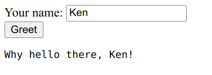
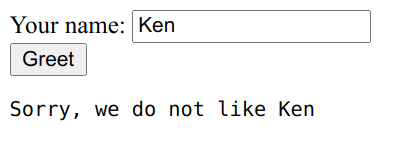

# Usage Guide

There are two steps to using AjaxView:

* Subclass `ajaxview.AjaxView` and use it as an enhanced `TemplateView`
* Use the `ajaxview.ajax` decorator to expose methods to your template

Consider the following example:



```python
from ajaxview import AjaxView, ajax


class MyController(AjaxView):
    template_name = 'hello.html'

    @ajax
    def greetings(self, name):
        return f'Why hello there, {name}!'
```

In your `hello.html`

```html
<!-- Necessary to include functions that communicate with Python class -->
{{ ajax_view }}

Your name: <input id="name"> <br>
<button onclick="sayHello()">Greet</button> <br>
<pre id="response"></pre>

<script>
  async function sayHello() {
    // This calls greetings on the server and serializes the response
    const message = await greetings({name: document.getElementById('name').value})
    document.getElementById('response').innerText = message
  }
</script>
```

Notice that because we have a `greetings` method on your controller class, an identically named JavaScript
function, `greetings()` is usable in your template. When you call that function, arguments you pass in JavaScript make
their way to the Python server and back again -- actually using Ajax methods and serialization is all taken care of.

For simple use cases, this can be compelling. The Ajax endpoint is the controller itself, with the POST method. (This
means your views using this class cannot accept POST data -- they're expected to be purely ajax pages!)

## Parameters

All parameters are expected to be named parameters in JavaScript. Eg,

```python
@ajax
def tell_story(self, noun, verb, adjective):
    return f'The {adjective} {noun} decided to {verb}'
```

In JavaScript:

```javascript
sentence = tell_story({noun: 'bird', verb: 'fly', adjective: 'restless'})
// 'The restless bird decided to fly'
```

### DateTime parameters

All serialization is done through JSON, however if you need datetime parameters on input, Ajax View will recognize type
annotation and deserialization ISO-formatted datetimes from JavaScript:

```python
@ajax


from datetime import datetime


def expect_the_future(self, when: datetime):
    ...
```

No other convenience features are provided for datetimes, so if you need more comprehensive serialization support, you
may consider using a more advanced framework.

## Exceptions

Errors will be thrown by the wrapper functions generated for your view.

Aside from bad requests, which should not happen if you use the auto-generated wrapper functions generated by
include `{{ ajax_view }}`, errors should fall into two categories:

* Server Errors (ie, bugs)
* Client Errors (ie, errors we tell the browser about to tell the user)

Client Errors are unique in that we do want to tell the browser about why the error occurred, presumably it's caused by
or actionable for the user. Validation errors are likely in this category, for instance.

To raise a client error, simply raise a `self.ClientError` instance with your error message:

```python
@ajax
def greetings(self, name):
    if name == 'Ken':
        # This will be available to the user to see
        raise self.ClientError('Sorry, we do not like Ken')
    else:
        return f'Why hello there, {name}!'
```

JavaScript:

```javascript
async function sayHello() {
  try {
    const message = await greetings({name: document.getElementById('name').value})
    document.getElementById('response').innerText = message
  } catch (error) {
    if (error.status === 400) {
      // Oh, it's our fault
      document.getElementById('response').innerText = error.errors[0]
    } else {
      throw(error)
    }
  }
}
```



## Logging

Exceptions are logged using the root level logger. You can override what logger is used by overriding the `get_logger` method:

```python
class MyController(AjaxView):
    def get_logger(self):
        ...
```